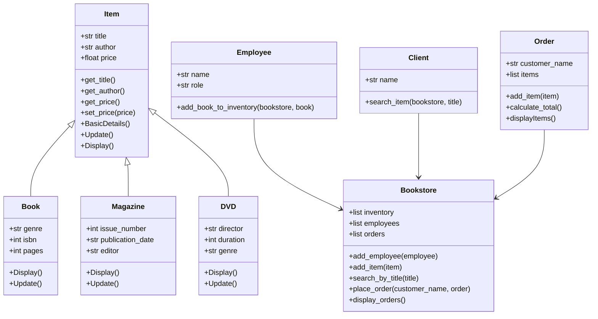

# 📚 Delailia's Bookshop  Management System 🌟


## 📖 Description

Welcome to **Delailia's Bookshop**! 🎉🎉  
This is a fully-fledged **object-oriented bookstore management system** designed using strong **encapsulation** principles. The system allows both **Employees** 👩‍💼👨‍💼 and **Clients** 👤 to interact seamlessly with the bookstore. 

Key features include:
- Clients can place orders, check book prices, and search for books 🔍📚.
- Employees have access to additional functionalities like managing inventory 📦, updating records ✏️, and viewing sales history 💳📊.

---

## 📑 Table of Contents

- [Features 🎯](#features-)
- [Installation 💻](#installation-)
- [Usage 🛠️](#usage-)


---

## 🎯 Features

### Client Features 🧑‍💻
- **Place Orders**: Easily order multiple books at once 🛒.
- **Check Prices**: Get real-time pricing information for any book 💰.
- **Search for Items**: Efficiently search for books by title, author, or genre 🔍.

### Employee Features 👩‍💼
- **Add to Inventory**: Add new books, magazines, or DVDs to the store 📚📖.
- **Update Items**: Modify existing inventory details such as price, title, or author ✏️.
- **View Customer Orders**: Review past customer orders and view total sales 💳📊.
- **Manage Inventory**: Search for specific items in the inventory 🔍📦.

---

## 💻 Installation

To run this application on your local machine:

1. Clone the repository:
   ```bash
   git clone https://github.com/yourusername/Delailias-Bookshop.git
   ```

2. Navigate to the project directory:
   ```bash
   cd Delailias-Bookshop
   ```


> **Note:** Ensure you have Python installed on your machine before running the script. If you are using another language, adjust accordingly.

---

## 🛠️ Usage

### Client Interaction Example 🧑‍💻

Here’s an example walkthrough of how a **client** can interact with the system:

```plaintext
---- Welcome to Delailia's Bookshop 📚 ----
Are you an Employee or a Client ?: client
Enter Name : John Doe
----- Welcome John Doe -----
1. Place an Order 🛒
2. Check Price 💰
3. Search for an Item 🔍
Enter your choice -> 1
**********************
How many items do you want to order? 2
Enter the title of the book? Harry Potter and the Philosopher's Stone
Item exists!
Do you want the Details? (y / n) y
------- Details ---------
Title : Harry Potter and the Philosopher's Stone
Author : J.K. Rowling
Price : 12.99 EGP
**********************
Enter the title of the book? Inception
Item exists!
Do you want the Details? (y / n) y
------- Details ---------
Title : Inception
Author : Christopher Nolan
Price : 14.99 EGP
```

### Employee Interaction Example 👩‍💼

Here’s an example walkthrough of how an **employee** can interact with the system:

```plaintext
---- Welcome to Delailia's Bookshop 📚 ----
Are you an Employee or a Client ?: employee
Enter Name : Alice Smith
Enter your Role : Manager
Enter the intended passcode : 1234
---- Employee Menu ----
1. Add to Inventory 📦
2. Check the Price for an Item 💰
3. Search for an Item 🔍
4. View Customer Orders 📊
5. Update an Item ✏️
Enter an Option -> 1
********************** What do you want to add to the inventory? : **********************
1. Book 📖
2. Magazine 📰
3. DVD 🎥
Enter a Number -> 2
.................................................................................................................................
Title of the Magazine : Time Out
The Author : David Walsh
The Issue Number : July 2024
Publication Date : 2024-07-01
Enter the Editor : John Doe
Enter Price : 5.99
Time Out by David Walsh is added Successfully ✅
---- Employee Menu ----
1. Add to Inventory 📦
2. Check the Price for an Item 💰
3. Search for an Item 🔍
4. View Customer Orders 📊
5. Update an Item ✏️
Enter an Option -> 4
Customer: John Doe
Items:
- Harry Potter and the Philosopher's Stone ($12.99)
- Inception ($14.99)
Total: $27.98 💸
---- Employee Menu ----
1. Add to Inventory 📦
2. Check the Price for an Item 💰
3. Search for an Item 🔍
4. View Customer Orders 📊
5. Update an Item ✏️
Enter an Option -> 5 **********************
What do you want to Update? : **********************
1. Book 📖
2. Magazine 📰
3. DVD 🎥
Enter a Number -> 1
What is the title of the book? Harry Potter and the Philosopher's Stone
Item exists!
What do you want to Update? :
1. Title 📚
2. Author 👩‍🎨
3. Genre 🎭
4. ISBN 🔢
5. Number of Pages 📄
6. Price 💰
Enter a Number -> 6
New Price of the Book : 300
Harry Potter and the Philosopher's Stone is updated Successfully ✅
```

---

### 🎯 Class Diagram 





